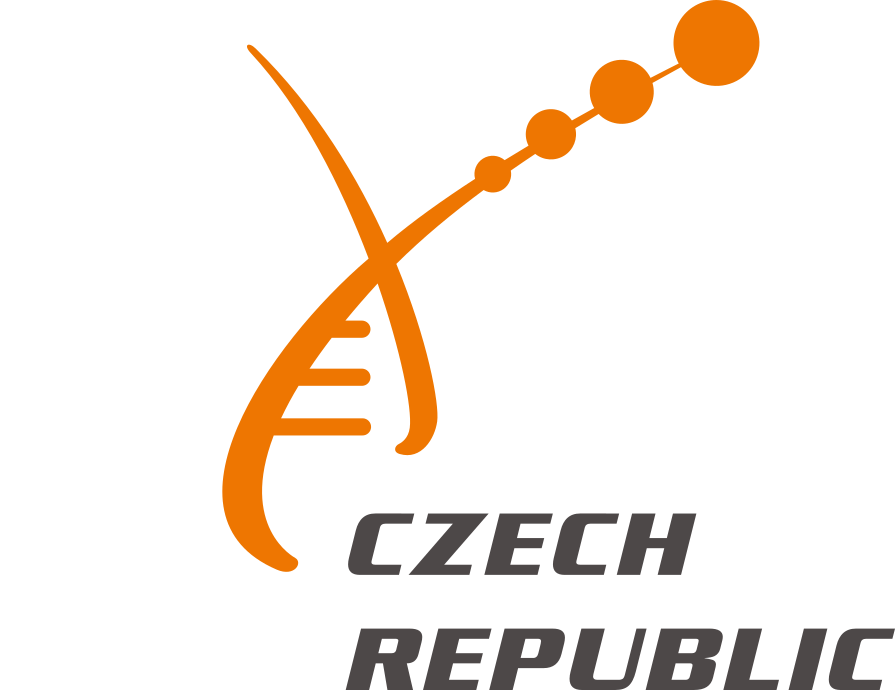

[](https://doi.org/10.5281/zenodo.15607543)

<div align="right">
  
  &nbsp;&nbsp;
  
</div>

# First steps in statistics for life science - with python

Statistics are an integral aspect of scientific research, particularly for the life sciences which rely heavily on quantitative methodologies. 
This course is designed to provide researchers in the life sciences with a gentle introduction to statistics and its application to a variety of biological problems.

This course is intended for scientists (and in particular life scientists) from all levels and disciplines who are not experts in statistics. 

Although we will provide materials and a reminder on data mamipulation in python, participant must be comfortable with the python environment and be able to read, understand and write basic python commands before attending this course. We also recommend some familiarity with the pandas, and matplotlib libraries.

The course will combine lectures on statistics, short tutorials and practical exercises on the topics discussed in the class. These practical exercises will be implemented in the widely used python language and environment for statistical computing and graphics.

## Technical prerequisites

Software to be installed **prior** to the course:

- **Miniconda** — package manager and environment management system ([install guide](https://www.anaconda.com/docs/getting-started/miniconda/install/overview))

### Setting up the environment

Create a conda environment from the provided `environment.yml` file:

```bash
conda env create -f environment.yml
```

The file specifies the environment name, package channels, and dependencies:

```yaml
name: statistics
channels:
  - defaults
  - conda-forge
dependencies:
  - pandas=2.3.3
  - scipy=1.17.1
  - seaborn=0.13.2
  - jupyter=1.1.1
  - scikit-learn=1.8.0
  - python=3.14.3
  - plotly=6.6.0
  - statsmodels=0.14.6
  - anndata=0.12.11
```

## Course Schedule

### Day 1 — 3. 6. 2026

#### Morning: Data Visualisation & Exploration

| Time | Session | Type | Duration |
|------|---------|------|----------|
| 09:30 – 09:40 | Welcome & course overview | Intro | 10 min |
| 09:40 – 10:10 | **Lecture** | Lecture | 30 min |
| 10:10 – 11:40 | **Hands-on session** | Exercises | 90 min |
| 11:40 – 12:40 | Lunch | — | 1 h |

#### Afternoon: Distributions & Hypothesis Testing

| Time | Session | Type | Duration |
|------|---------|------|----------|
| 12:40 – 14:10 | **Lecture**  | Lecture | 90 min |
| 14:10 – 15:10 | **Hands-on session**  | Exercises | 1 h |
| 15:10 – 15:25 | Break | — | 15 min |
| 15:25 – 16:25 | **Hands-on session** | Exercises | 1 h |

---

### Day 2 — 4. 6. 2026

#### Morning: Statistical Testing, Continued

| Time | Session | Type | Duration |
|------|---------|------|----------|
| 09:30 – 10:30 | **Lecture** | Lecture | 1 h |
| 10:30 – 11:15 | **Hands-on session** | Exercises | 45 min |
| 11:15 – 11:30 | Break | — | 15 min |
| 11:30 – 12:15 | **Hands-on session** | Exercises | 45 min |
| 12:15 – 13:15 | Lunch | — | 1 h |

#### Afternoon: Correlation & Regression

| Time | Session | Type | Duration |
|------|---------|------|----------|
| 13:15 – 13:45 | **Lecture** | Lecture | 30 min |
| 13:45 – 14:45 | **Hands-on session** | Exercises | 1 h |
| 14:45 – 15:00 | Break | — | 15 min |
| 15:00 – 16:00 | **Hands-on session** | Exercises | 1 h |


## Course organization

The course is organized in several, numbered, jupyter notebooks, each corresponding to a chapter which interleaves theory, code demo, and exercises.

The course does not require any particular expertise with jupyter notebooks to be followed, but if it is the first time you encounter them we recommend this [gentle introduction](https://realpython.com/jupyter-notebook-introduction/).

 * [01_exploratory_data_analysis.ipynb](01_exploratory_data_analysis.ipynb ) : an introduction without much statistics, to get everyone up to speed on the pandas, matplotlib, and seaborn libraries. 
 * [02_distribution_and_statistical_tests.ipynb](02_distribution_and_statistical_tests.ipynb)
 * [03_distribution_and_statistical_tests_continued.ipynb](03_distribution_and_statistical_tests_continued.ipynb)
 * [04_correlation_and_regression.ipynb](04_correlation_and_regression.ipynb)


Solutions to each practical can be found in the `solutions/` folder and should be loadable directly in the jupyter notebook themselves.

## Acknowledgments

This course is supported by [ELIXIR CZ](https://www.elixir-czech.cz/) and offered free of charge to participants.

This course is based on material originally developed by Wandrille Duchemin for the SIB training course "Introduction to Statistics with Python". 

Wandrille Duchemin. (2025, June 6). Material for the "Introduction to Statistics with Python" SIB-training course adapted for a self-learning experience. Zenodo. https://doi.org/10.5281/zenodo.15607543
